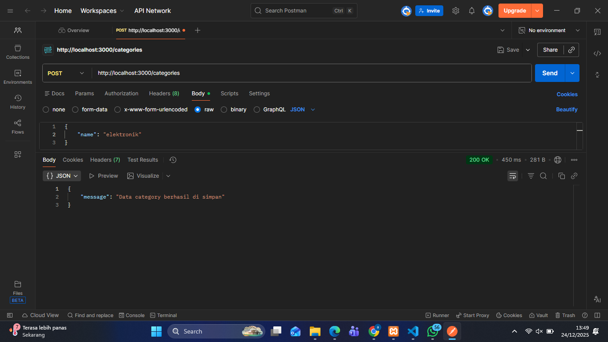
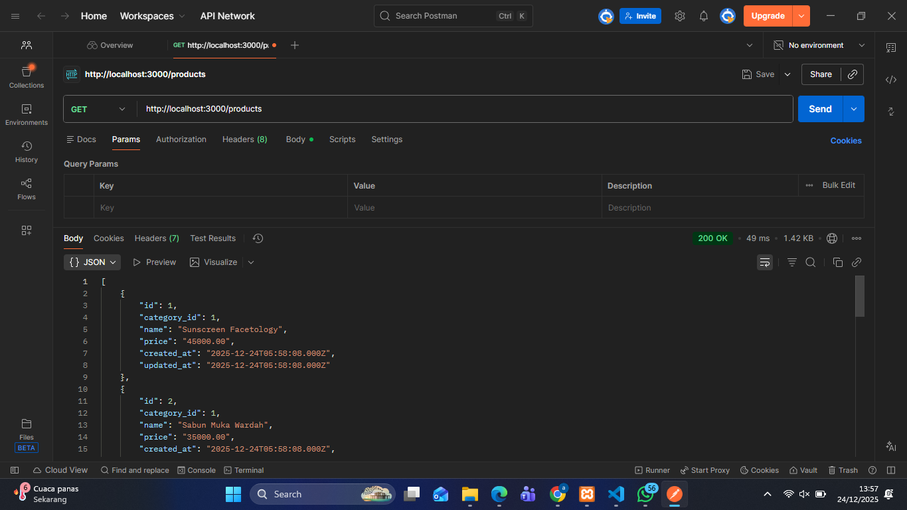
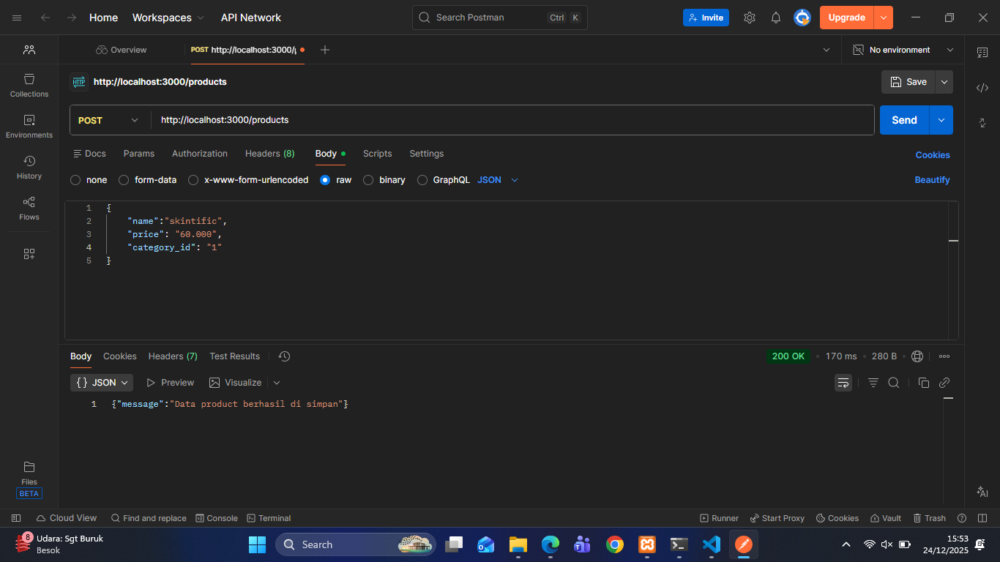

# NodeJS-CRUD-Restapi

**Nama :** Alif Avicena Alfitrah  
**NIM :** 24090094
**Kelas :** 3C  

---

## Cara menjalankan project

1. Download project
2. Buat database pada localhost
3. Buka folder project dan jalankan di text editor
4. Buka terminal (CMD) pada folder project lalu jalankan:
   ```bash
   npm run dev
5. Cek server berhasil atau tidak
6. Test rest API menggunakan postman

---

## Hasil di dalam postman

## CRUD pada tabel categories

### View categories
!(skrinsut/categories-get.png)

### View categories by id


### Create categories  


### Update categories 


### Delete categories 


---

## CRUD pada tabel products

### View products


### View products by id


### Create products


### Update products


### Delete products

